# Задание 1: Базовое подключение

1. Создаю dockerfile.managed в нём будет ssh, на который ansible будет подключатся 

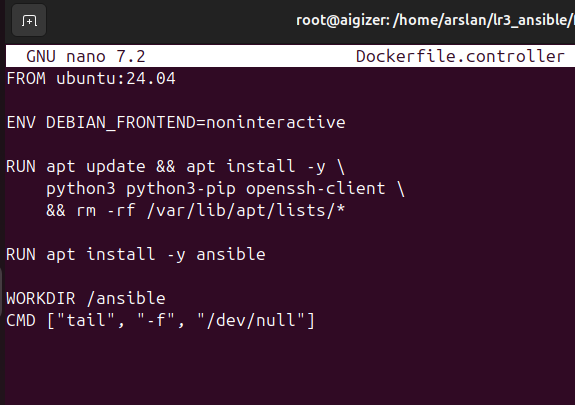

2. Создаю dockerfile.controller в котором работает ansible, который выполняет playbooks. где будут команды ansible,ansible-playbook 

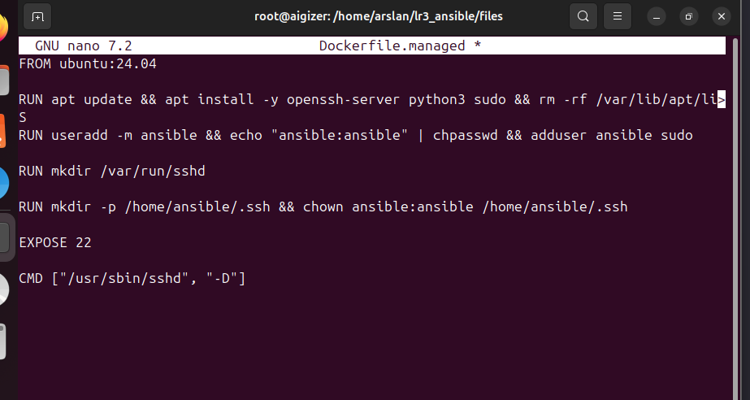

3. Создаю docker-compose.yml

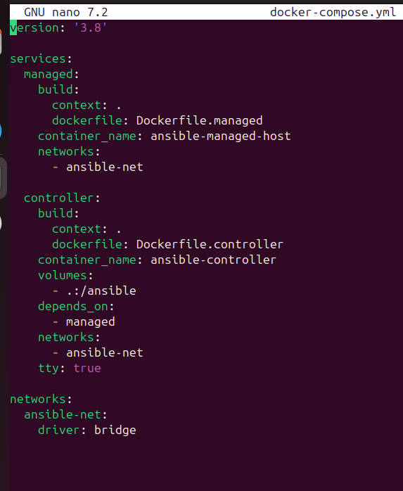

4. Запускаю контенер

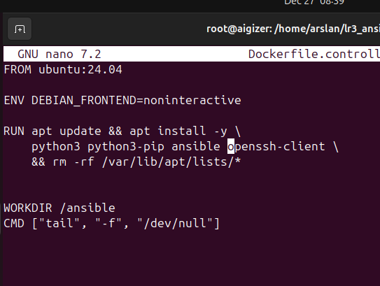

5. Захожу в ansible

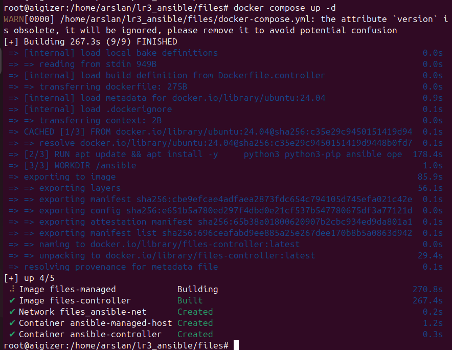

6. Создаю inventory.ini

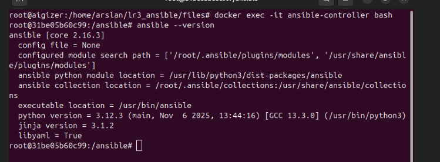

7. Генерирую ключ 

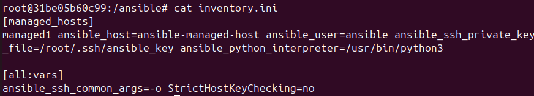

8. копирую публичный ключ в управляемый контенер и приватный

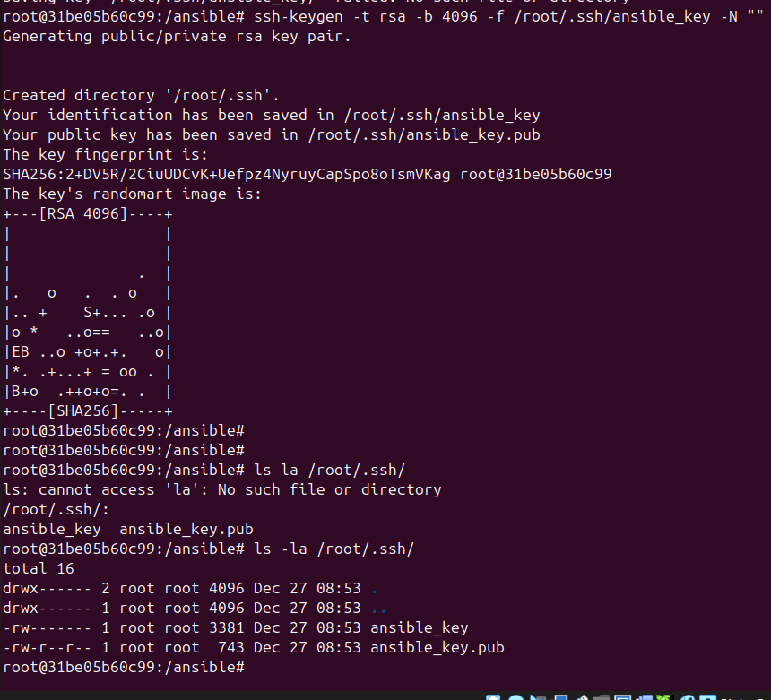

9. запускаю ключ от хоста

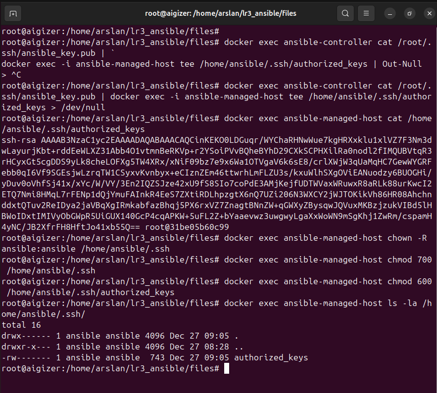

10. проверяю проверку подключения из нутри контенера

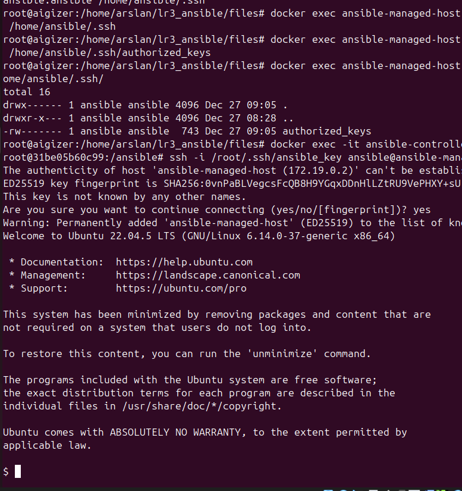

# Задание 2: Базовые ad-hoc команды

11. выполняем все команды по методичке, (зная что 4 команда работать не будет, поэтому только попытка)

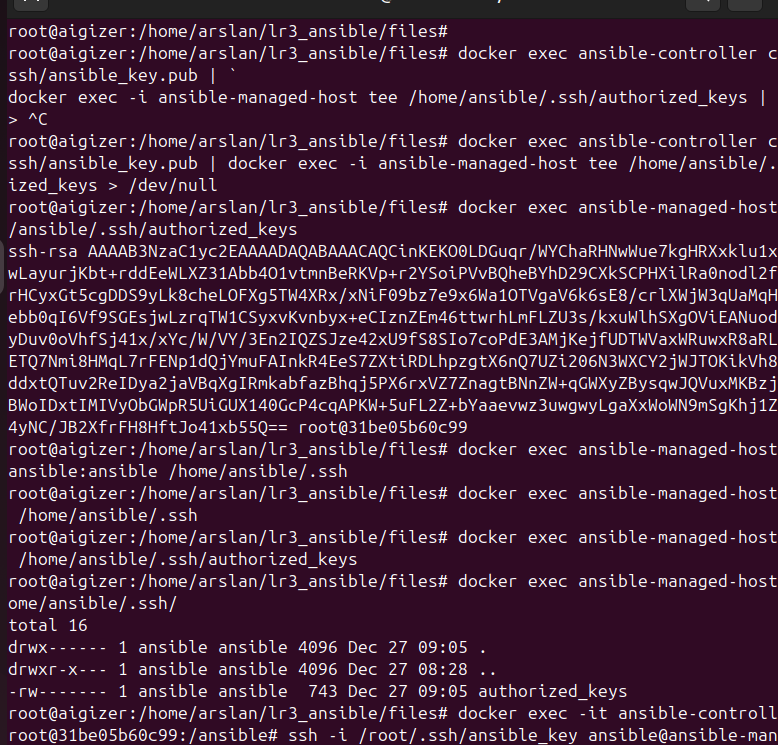

# Задание 3: Работа с файлами

12. Создадим новый playbook

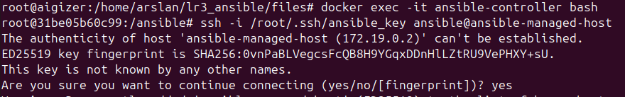

13. Запустим playbook

14. Создайте новый playbook task3_files.yml

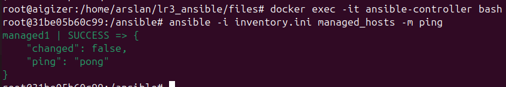

15. Запустим playbook. Ожидаемый результат: три директории с файлами, созданные на управляемом хосте

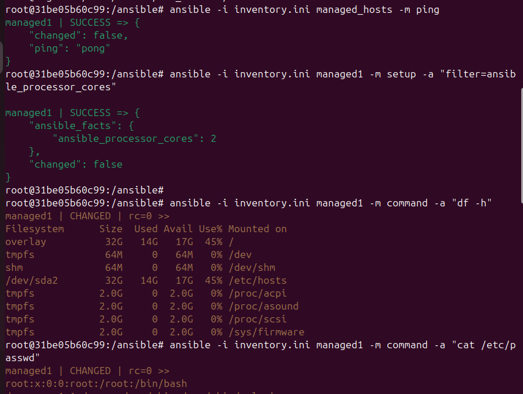